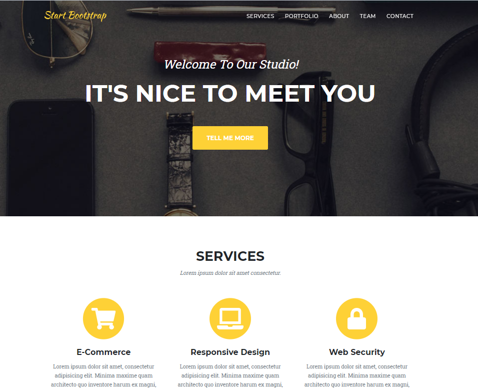

# Rapport laboratoire HTTP infrastructure RES 2021
## Auteurs
- Forestier Quentin
- Herzig Melvyn

## Environnement
Toutes les manipulations présentées ont été effectuées sous Windows 10 avec Docker + WSL.

---
## Étape 1) Mise en place d'un site statique avec apache httpd
Cette étape consiste à mettre un place une image Docker permettant de créer 
des conteneurs avec php:7.2 et déployer un site statique.

### Apache-php-image
Le répertoire (<i> Docker/apache-php-image</i>) contient le dockerfile permettant
la création du conteneur décrit plus haut.

Contenu du dockerfile:
```
FROM php:7.2-apache
COPY content/ /var/www/html/
```

Il indique la version de php sur laquelle construire l'image. Ensuite il copie le répertoire <i>content/</i> (local)
dans le répertoire <i>/var/www/html/</i> (du container). Ce dernier est utilisé pour la recherche des pages du site. Il est configurable dans
<i>/etc/apache2/sites-available/000-default.conf</i>.

### Template
Le template a été téléchargé sur: <a>https://startbootstrap.com/theme/agency</a>



### État de l'infrastructure
Un navigateur est capable de consulter les sites des deux conteneurs fabriqués à partir de Apache-php-image.


---
## Étape 2) Mise en place d'un site dynamique avec expresse
Cette étape consiste à mettre un place une image Docker permettant de créer 
des conteneurs avec node:14.16 et déployer un site dynamique

### Expresse-image
Le répertoire (<i> Docker/expresse-image</i>) contient le dockerfile permettant
la création du conteneur décrit plus haut.

Contenu du dockerfile:
```
FROM node:14.16
COPY src/ /opt/app
CMD ["node", "/opt/app/index.js"]
```

Il indique la version de node.js sur laquelle construire l'image. Ensuite il copie le répertoire <i>src/</i> (local)
dans le répertoire <i>/opt/app</i> (du container). La seconde commande effectue un transfert de l'applicatif local dans le conteneur. Finalement, on définit
qu'il faut démarrer node.js sur notre application, au démarrage du conteneur.  

### Contenu dynamique
À l'aide d'expresse.js , le site utilise la dépendance [sentencer](https://kylestetz.github.io/Sentencer/) pour générer des adjectifs et des noms
aléatoires. Nous formons ensuite des pseudos aléatoires formés de la façon suivante: <adjectif1> <adjectif2> <nom>
  
Les pseudos (entre 1 et 10) sont ensuite encapsulé un payload Json depuis la fonction <i>generateCoolNames()</i>.

L'application accepte des requêtes sur le port 3000
```
var Sentencer = require('sentencer');
var express = require('express');
var app = express();


/**
 * When we get a request we send an array of cool names.
 */
app.get('/', function(req, res){
    res.send(generateCoolNames());
});

/**
 * Accept request on port 3000.
 */
app.listen(3000, function(){
    console.log("Accepting HTTP requests on port 3000!");
});

/**
 * This functions generates between 0 and 10 names (adj adj noun)
 * @returns Array containing the names.
 */
function generateCoolNames()
{
    var numberOfNames = Math.floor((Math.random() * 10) + 1);

    var names = [];

    for(var i = 0; i < numberOfNames; ++i)
    {
        names.push({coolName: Sentencer.make("{{ adjective }} {{ adjective }} {{ noun }}")})
    }

    return names;
}
```

### Résultat d'une connexion
Voici le résultat d'une connexion avec postman.


### État de l'infrastructure
Il est possible d'effectuer des requêtes avec un navigateur, un client telnet ou postman.


---
## Étape 3) Reverse proxy avec apache (configuration statique)
Durant cette étape, nous avons mis en place un reverse proxy avec les adresses ip hardcodées.

En principe, pour que la configuration fonctionne, il faut démarrer les conteneurs dans
l'ordre suivant:

- apache-php-image : IP 172.17.0.2
- express-image : IP 172.17.0.3 
- apache-reverse-proxy : IP peu importe.

> Si les deux premiers conteneurs ne recoivent l'ip associées, il faut modifier le fichier 001-reverse-proxy.conf

### Reverse proxy
Voici la configuration du reverse proxy <i> Docker/apache-reverse-proxy/conf/sites-available/001-reverse-proxy.conf</i>.

```
<VirtualHost *:80>

        ServerName demo.res.ch

        #ErrorLog ${APACHE_LOG_DIR}/error.log
        #CustomLog ${APACHE_LOG_DIR}/access.log combined

        ProxyPass "/api/names/" "http://172.17.0.3:3000/"
        ProxyPassReverse "/api/names/" "http://172.17.0.3:3000/"

        ProxyPass "/" "http://172.17.0.2:80/"
        ProxyPassReverse "/" "http://172.17.0.2:80/"

</VirtualHost>
```
> Nous accédons aux deux serveurs web en demandant l'hôte: demo.res.ch

> Si la ressource /api/names/ est demandée, le serveur basé sur <i>express-image</i> répond.

> Sinon le serveur basé sur <i>apache-php-image</i> répond.

Dans le fichier <i> Docker/apache-reverse-proxy/conf/sites-available/000-default.conf</i>

```
<VirtualHost *:80>
        # This an empty virtual host.
</VirtualHost>
```

> Nous avons désactivé l'hôte virtuel. Le conteneur du reverse proxy ne délivre aucune ressource issue de son serveur apache.

L'image du conteneur est produite à l'aide du docker file suivant.
```
FROM php:7.2-apache 

COPY conf/ /etc/apache2

RUN a2enmod proxy proxy_http
RUN a2ensite 000-* 001-*
```
> L'image est construite sur la base de php 7.2

> Ajoute le dossier /sites-available (local) au contenu de /etc/apache2/sites-available (distant)

> Active les extension de proxy et active nos deux fichiers de configuration.

<b> Afin de pouvoir se connecter au proxy, il est important de mapper son port 80</b>
>$ docker run -p 8080:80 <nom de l'image du reverse proxy>

### Récupération du contenu
A ce moment, le seul point d'entrée mappé est le reverse proxy. Il est donc impossible de discuter directement avec les
deux autres serveurs.

Afin de pouvoir se connecter depuis un navigateur, il faut modifier le fichier <i> C:\Windows\System32\drivers\etc\hosts </i> en y ajoutant la ligne:
```
127.0.0.1		demo.res.ch
```
Désormais, le contenu des deux sites (étapes 1 et étape2) peut être récupéré.


### État de l'infrastructure
Un navigateur est capable de consulter les sites des deux conteneurs fabriqués à partir de Apache-php-image.


## Étape 4) Requêtes AJAX avec JQUERY
Au terme de cette étape, nous avons édité le site php statique afin qu'il effectue des requêtes asynchrones
vers le site express dynamique.

> Retrospectivement, les 3 Dockerfiles ont été modifiés afin d'installer vim sur les images.

### Script JQUERY
La page d'accueil (dans <i> docker-images/apache-php-image/content/index.html</i>) a été modifiée pour charger le script
<i> docker-images/apache-php-image/content/js/coolnames.js</i> 

```
$(function() {

    console.log("loading cool names");
    function loadCoolNames(){
            $.getJSON("/api/names/", function( names ){
                    console.log( names );

                    var message = "";
                    for(i = 0; i < names.length; i++){
                            message +="<h3>"+ names[i].coolName + "</h3><br/>";
                    }

                    console.log(message);

                    $(".coolNamesClass").html(message);

            });
    };

    loadCoolNames();
    setInterval(loadCoolNames, 5000);
});
```
> Ce script effectue une requête asynchrone (toutes les 5 secondes) vers notre site express.
> Il récupère la réponse au format JSON. Il la transforme en créant des titre h3 qui seront placé dans la balise
> de classe "coolNamesClass".

Comme le montre la console de notre navigateur.


> Nous voyons que la fonction est appelée depuis la requête grâce au log "Loading cool names"

> Ensuite, nous appercevons la réponse JSON.

> Finalement, nous voyons le post-traitement de la réponse.

Voici un aperçu des requêtes interceptées depuis notre navigateur.


> Dans un premier temps, nous observons la demande vers demo.res.ch de la ressource /api/names/

> Finalement, nous avons l'entête de la réponse.

### Importance du proxy
Le reverse proxy joue un rôle essentiel. Une politique appelée "Same-origin policy" empêche le chargement
de ressources en provenance de différentes sources (notre conteneur static vs notre conteneur dynamic).

Or, d'un point de vue client (de notre navigateur), toutes les ressources proviennent du reverse proxy, ce qui respect la "Same-origin policy".

### Aperçu
Voici le site statique avec la section "here are some cool names for you!" qui se met à jour toutes les 5 secondes.
Chaque nouvelle liste est composée de longueur variable (entre 1 et 10, voir étape 2 pour plus d'information sur le génération des listes).


### État de l'infrastructure
En se connectant, la page statique est chargée.
Dans un second temps et après chaque 5 seconde, la liste des <i>cool names</i> est mise à jour.


