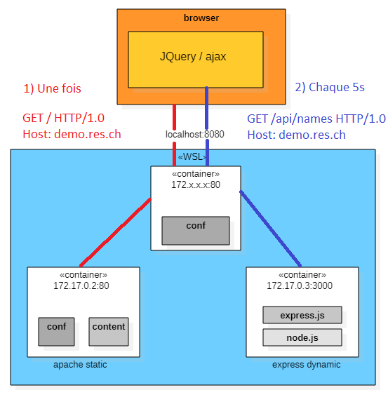

# Rapport laboratoire HTTP infrastructure RES 2021
## Auteurs
- Forestier Quentin
- Herzig Melvyn

## Environnement
Toutes les manipulations présentées ont été effectuées sous Windows 10 avec Docker + WSL.

---
## Étape 1) Mise en place d'un site statique avec apache httpd
<b> Branche: </b> fb-apache-static.

Cette étape consiste à mettre un place une image Docker permettant de créer 
des conteneurs avec php:7.2 et déployer un site statique.

### Apache-php-image
Le répertoire (<i> Docker/apache-php-image</i>) contient le dockerfile permettant
la création du conteneur décrit plus haut.

Contenu du dockerfile:
```
FROM php:7.2-apache
COPY content/ /var/www/html/
```

Il indique la version de php sur laquelle construire l'image. Ensuite il copie le répertoire <i>content/</i> (local)
dans le répertoire <i>/var/www/html/</i> (du container). Ce dernier est utilisé pour la recherche des pages du site. Il est configurable dans
<i>/etc/apache2/sites-available/000-default.conf</i>.

### Template
Le template a été téléchargé sur: <a>https://startbootstrap.com/theme/agency</a>


### État de l'infrastructure
Un navigateur est capable de consulter les sites des deux conteneurs fabriqués à partir de Apache-php-image.


---
## Étape 2) Mise en place d'un site dynamique avec expresse
<b> Branche: </b> fb-expresse-dynamic.

Cette étape consiste à mettre un place une image Docker permettant de créer 
des conteneurs avec node:14.16 et déployer un site dynamique

### Expresse-image
Le répertoire (<i> Docker/expresse-image</i>) contient le dockerfile permettant
la création du conteneur décrit plus haut.

Contenu du dockerfile:
```
FROM node:14.16
COPY src/ /opt/app
CMD ["node", "/opt/app/index.js"]
```

Il indique la version de node.js sur laquelle construire l'image. Ensuite il copie le répertoire <i>src/</i> (local)
dans le répertoire <i>/opt/app</i> (du container). La seconde commande effectue un transfert de l'applicatif local dans le conteneur. Finalement, on définit
qu'il faut démarrer node.js sur notre application, au démarrage du conteneur.  

### Contenu dynamique
À l'aide d'expresse.js , le site utilise la dépendance [sentencer](https://kylestetz.github.io/Sentencer/) pour générer des adjectifs et des noms
aléatoires. Nous formons ensuite des pseudos aléatoires formés de la façon suivante: <adjectif1> <adjectif2> <nom>
  
Les pseudos (entre 1 et 10) sont ensuite encapsulé un payload Json depuis la fonction <i>generateCoolNames()</i>.

L'application accepte des requêtes sur le port 3000
```
var Sentencer = require('sentencer');
var express = require('express');
var app = express();


/**
 * When we get a request we send an array of cool names.
 */
app.get('/', function(req, res){
    res.send(generateCoolNames());
});

/**
 * Accept request on port 3000.
 */
app.listen(3000, function(){
    console.log("Accepting HTTP requests on port 3000!");
});

/**
 * This functions generates between 0 and 10 names (adj adj noun)
 * @returns Array containing the names.
 */
function generateCoolNames()
{
    var numberOfNames = Math.floor((Math.random() * 10) + 1);

    var names = [];

    for(var i = 0; i < numberOfNames; ++i)
    {
        names.push({coolName: Sentencer.make("{{ adjective }} {{ adjective }} {{ noun }}")})
    }

    return names;
}
```

### Résultat d'une connexion
Voici le résultat d'une connexion avec postman.


### État de l'infrastructure
Il est possible d'effectuer des requêtes avec un navigateur, un client telnet ou postman.


---
## Étape 3) Reverse proxy avec apache (configuration statique)
<b> Branche: </b> fb-apache-reverse-proxy.

Durant cette étape, nous avons mis en place un reverse proxy avec les adresses ip hardcodées.

En principe, pour que la configuration fonctionne, il faut démarrer les conteneurs dans
l'ordre suivant:

- apache-php-image : IP 172.17.0.2
- express-image : IP 172.17.0.3 
- apache-reverse-proxy : IP peu importe.

> Si les deux premiers conteneurs ne recoivent l'ip associées, il faut modifier le fichier 001-reverse-proxy.conf

### Reverse proxy
Voici la configuration du reverse proxy <i> Docker/apache-reverse-proxy/conf/sites-available/001-reverse-proxy.conf</i>.

```
<VirtualHost *:80>

        ServerName demo.res.ch

        #ErrorLog ${APACHE_LOG_DIR}/error.log
        #CustomLog ${APACHE_LOG_DIR}/access.log combined

        ProxyPass "/api/names/" "http://172.17.0.3:3000/"
        ProxyPassReverse "/api/names/" "http://172.17.0.3:3000/"

        ProxyPass "/" "http://172.17.0.2:80/"
        ProxyPassReverse "/" "http://172.17.0.2:80/"

</VirtualHost>
```
> Nous accédons aux deux serveurs web en demandant l'hôte: demo.res.ch

> Si la ressource /api/names/ est demandée, le serveur basé sur <i>express-image</i> répond.

> Sinon le serveur basé sur <i>apache-php-image</i> répond.

Dans le fichier <i> Docker/apache-reverse-proxy/conf/sites-available/000-default.conf</i>

```
<VirtualHost *:80>
        # This an empty virtual host.
</VirtualHost>
```

> Nous avons désactivé l'hôte virtuel. Le conteneur du reverse proxy ne délivre aucune ressource issue de son serveur apache.

L'image du conteneur est produite à l'aide du docker file suivant.
```
FROM php:7.2-apache 

COPY conf/ /etc/apache2

RUN a2enmod proxy proxy_http
RUN a2ensite 000-* 001-*
```
> L'image est construite sur la base de php 7.2

> Ajoute le dossier /sites-available (local) au contenu de /etc/apache2/sites-available (distant)

> Active les extension de proxy et active nos deux fichiers de configuration.

<b> Afin de pouvoir se connecter au proxy, il est important de mapper son port 80</b>
>$ docker run -p 8080:80 <nom de l'image du reverse proxy>

### Récupération du contenu
A ce moment, le seul point d'entrée mappé est le reverse proxy. Il est donc impossible de discuter directement avec les
deux autres serveurs.

Afin de pouvoir se connecter depuis un navigateur, il faut modifier le fichier <i> C:\Windows\System32\drivers\etc\hosts </i> en y ajoutant la ligne:
```
127.0.0.1		demo.res.ch
```
Désormais, le contenu des deux sites (étapes 1 et étape2) peut être récupéré.


### État de l'infrastructure
Un navigateur est capable de consulter les sites des deux conteneurs fabriqués à partir de Apache-php-image.


## Étape 4) Requêtes AJAX avec JQUERY
<b> Branche: </b> fb-ajax-query.

Au terme de cette étape, nous avons édité le site php statique afin qu'il effectue des requêtes asynchrones
vers le site express dynamique.

> Retrospectivement, les 3 Dockerfiles ont été modifiés afin d'installer vim sur les images.

### Script JQUERY
La page d'accueil (dans <i> docker-images/apache-php-image/content/index.html</i>) a été modifiée pour charger le script
<i> docker-images/apache-php-image/content/js/coolnames.js</i> 

```
$(function() {

    console.log("loading cool names");
    function loadCoolNames(){
            $.getJSON("/api/names/", function( names ){
                    console.log( names );

                    var message = "";
                    for(i = 0; i < names.length; i++){
                            message +="<h3>"+ names[i].coolName + "</h3><br/>";
                    }

                    console.log(message);

                    $(".coolNamesClass").html(message);

            });
    };

    loadCoolNames();
    setInterval(loadCoolNames, 5000);
});
```
> Ce script effectue une requête asynchrone (toutes les 5 secondes) vers notre site express.
> Il récupère la réponse au format JSON. Il la transforme en créant des titre h3 qui seront placé dans la balise
> de classe "coolNamesClass".

Comme le montre la console de notre navigateur.


> Nous voyons que la fonction est appelée depuis la requête grâce au log "Loading cool names"

> Ensuite, nous appercevons la réponse JSON.

> Finalement, nous voyons le post-traitement de la réponse.

Voici un aperçu des requêtes interceptées depuis notre navigateur.


> Dans un premier temps, nous observons la demande vers demo.res.ch de la ressource /api/names/

> Finalement, nous avons l'entête de la réponse.

### Importance du proxy
Le reverse proxy joue un rôle essentiel. Une politique appelée "Same-origin policy" empêche le chargement
de ressources en provenance de différentes sources (notre conteneur static vs notre conteneur dynamic).

Or, d'un point de vue client (de notre navigateur), toutes les ressources proviennent du reverse proxy, ce qui respect la "Same-origin policy".

### Aperçu
Voici le site statique avec la section "here are some cool names for you!" qui se met à jour toutes les 5 secondes.
Chaque nouvelle liste est composée de longueur variable (entre 1 et 10, voir étape 2 pour plus d'information sur le génération des listes).


### État de l'infrastructure
En se connectant, la page statique est chargée.
Dans un second temps et après chaque 5 seconde, la liste des <i>cool names</i> est mise à jour.



---
## Étape 5) Configuration dynamique du reverse proxy
<b> Branche: </b> fb-dynamic-configuration.

Au terme de cette étape, les adresses ip dans <i> Docker/apache-reverse-proxy/conf/sites-available/001-reverse-proxy.conf</i>
sont ajoutées dynamiquement à l'aide des variables d'environnement Docker reçu avec la commande run et l'argument <i>-e</i>.

### Génération dynamique de l'hôte virtuelle
Afin de générer l'hôte virtuelle dynamiquement, nous avons créé notre propre version du script <i> apache2-foreground</i> 
utilisé dans l'image [php:apache-7.2](https://github.com/docker-library/php/blob/master/7.3/buster/apache/apache2-foreground).
Le fichier complet se trouve dans <i> docker-images/apache-reverse-proxy/apache2-foreground</i>

Basiquement la ligne suivante a été ajouté:
```
php /var/apache2/templates/config-template.php > /etc/apache2/sites-available/001-reverse-proxy.conf
```
Elle permet de compléter le template <i>config-template.php</i> grâce à php et de stocker le résultat dans l'hôte virtuel de <i>001-reverse-proxy.conf</i>.

> Désormais, le contenu initial (présenté à l'étape 3) dans <i>001-reverse-proxy.conf</i> n'est plus important. Il est remplacé par le moteur de template

La page d'accueil (dans <i> docker-images/apache-php-image/content/index.html</i>) a été modifiée pour charger le script
<i> docker-images/apache-php-image/content/js/coolnames.js</i> 

#### Fichier config-template.php

Le contenu du fichier <i>docker-images/apache-reverse-proxy/templates/config-template.php</i> est le suivant:

```
<?php
  $DYNAMIC_APP = getenv('DYNAMIC_APP');
  $STATIC_APP = getenv('STATIC_APP');
?>

<VirtualHost *:80>

    ServerName demo.res.ch

    # ErrorLog ${APACHE_LOG_DIR}/error.log
    # CustomLog ${APACHE_LOG_DIR}/access.log combined
  
    ProxyPass '/api/names/' 'http://<?php print "$DYNAMIC_APP"?>/'
    ProxyPassReverse '/api/names/' 'http://<?php print "$DYNAMIC_APP"?>/'

    ProxyPass '/' 'http://<?php print "$STATIC_APP"?>/'
    ProxyPassReverse '/' 'http://<?php print "$STATIC_APP"?>/'

</VirtualHost>
```

> Il récupère les variable d'environnement DYNAMIC_APP et STATIC_APP afin de les insérer dans l'hôte virtuelle.
> Ces deux variables sont sensés représenter l'adresse ip et le port de leur conteneur respectif.

#### Dockerfile

En conséquence le Dockerfile <i>/docker-images/apache-reverse-proxy/Dockerfile</i> a été modifié.

```
FROM php:7.2-apache 

RUN apt-get update && \
    apt-get install -y vim

COPY apache2-foreground /usr/local/bin/
COPY templates/ /var/apache2/templates/
COPY conf/ /etc/apache2

RUN a2enmod proxy proxy_http
RUN a2ensite 000-* 001-*
```
> Désormais, il remplace le fichier <i>apache2-foreground</i> dans /usr/local/bin par notre propre version.
> De plus, il place le fichier <i>docker-images/apache-reverse-proxy/templates/config-template.php</i> dans <i>/var/apache2/templates/</i>.

### Script de démarrage

Comme le démarrage de l'infrastructure devient fastidieux, nous avons mis en place un script powerShell afin de démarrer
tout ce petit monde. Le fichier s'appelle <i>startInfra.ps1</i> et se trouve à la racine de répertoire.

N'utilisez pas ce script si vous avez des conteneurs qui ne doivent pas être supprimés.

```
# Nettoyage des conteneurs
Write-Output "--- Kill des conteneurs"
docker kill $(docker ps -qa)

Write-Output "--- Retrait des conteneurs"
docker rm $(docker ps -qa)

# Vérification de l'existence des images
$existApachePhp = docker images -q res/apache_php
if($null -eq $existApachePhp)
{
    Write-Output "--- Build apache_static"
    docker build -t res/apache_php ./docker-images/apache-php-image/
}

$existExpressDynamic = docker images -q res/express_names
if($null -eq $existExpressDynamic)
{
    Write-Output "--- Build express_dynamic"
docker build -t res/express_names ./docker-images/express-image/    
}

$existApacheRP = docker images -q res/apache_rp
if($null -eq $existApacheRP)
{
    Write-Output "--- Build apache_rp"
    docker build -t res/apache_rp ./docker-images/apache-reverse-proxy/
}

# Démarrage des conteneurs
Write-Output "--- Demarrage du conteneur apache static"
docker run -d --name apache_static res/apache_php


Write-Output "--- Demarrage du conteneur expresse dynamic"
docker run -d --name express_dynamic res/express_names


Write-Output "--- Demarrage du conteneur apache reverse proxy"
$static_app = docker inspect -f '{{range .NetworkSettings.Networks}}{{.IPAddress}}{{end}}' apache_static 
$dynamic_app = docker inspect -f '{{range .NetworkSettings.Networks}}{{.IPAddress}}{{end}}' express_dynamic
 

docker run -d -p 8080:80 -e STATIC_APP=$($static_app + ':80') -e DYNAMIC_APP=$($dynamic_app + ':3000') --name apache_rp res/apache_rp
```

> Le script commence par éteindre et supprimer tous les conteneurs (évitez donc d'utiliser ce script si vous avez des conteneurs importants).

> Ensuite il vérifie si les images existes sinon il les construit. Si les images sont présentes mais que vous voulez les mettre à jour, il faut les supprimer manuellement.
> De cette façon, nous évitons de rebuild les images si ces dernières n'ont pas été modifiées

> Finalement, il démarre les sites statique et dynamiques, récupères leur adresse ip et démarre le reverse proxy en lui donnant les
> adresses en variable d'environnement.


### État de l'infrastructure


---
## Bonus 1) Balancement de charge
<b> Branche: </b> fb-load-balancing.

Cette étape consistait à la mise en place d'un répartisseur de charge au niveau du reverse proxy

### Mise à jour du script de lancement de l'infra structure.
Pour illustrer le balancement de charge, nous créons, non plus un conteneur apache statique et un conteneur expresse dynamique,
mais deux de chaque.

Le lancement du conteneur du reverse proxy a été modifié pour integré les deux nouvelles ip de l'infrastructure

Nouveau scripte <i>startInfra.ps1</i>
```
# Nettoyage des conteneurs
Write-Output "--- Kill des conteneurs"
docker kill $(docker ps -qa)

Write-Output "--- Retrait des conteneurs"
docker rm $(docker ps -qa)

# Vérification de l'existence des images
$existApachePhp = docker images -q res/apache_php
if($null -eq $existApachePhp)
{
    Write-Output "--- Build apache_static"
    docker build -t res/apache_php ./docker-images/apache-php-image/
}

$existExpressDynamic = docker images -q res/express_names
if($null -eq $existExpressDynamic)
{
    Write-Output "--- Build express_dynamic"
docker build -t res/express_names ./docker-images/express-image/    
}

$existApacheRP = docker images -q res/apache_rp
if($null -eq $existApacheRP)
{
    Write-Output "--- Build apache_rp"
    docker build -t res/apache_rp ./docker-images/apache-reverse-proxy/
}

# Démarrage des conteneurs
Write-Output "--- Demarrage des conteneurs apache static"
docker run -d --name apache_static1 res/apache_php
docker run -d --name apache_static2 res/apache_php


Write-Output "--- Demarrage des conteneurs expresse dynamic"
docker run -d --name express_dynamic1 res/express_names
docker run -d --name express_dynamic2 res/express_names


Write-Output "--- Demarrage du conteneur apache reverse proxy"
$static_app1 = docker inspect -f '{{range .NetworkSettings.Networks}}{{.IPAddress}}{{end}}' apache_static1 
$static_app2 = docker inspect -f '{{range .NetworkSettings.Networks}}{{.IPAddress}}{{end}}' apache_static2 
$dynamic_app1 = docker inspect -f '{{range .NetworkSettings.Networks}}{{.IPAddress}}{{end}}' express_dynamic1
$dynamic_app2 = docker inspect -f '{{range .NetworkSettings.Networks}}{{.IPAddress}}{{end}}' express_dynamic2
 

docker run -d -p 8080:80 -e STATIC_APP1=$($static_app1 + ':80') -e STATIC_APP2=$($static_app2 + ':80') -e DYNAMIC_APP1=$($dynamic_app1 + ':3000') -e DYNAMIC_APP2=$($dynamic_app2 + ':3000') --name apache_rp res/apache_rp

```

### Mise à jour du dockerfile

Le contenu du fichier <i>docker-images/apache-reverse-proxy/Dockerfile</i> a été mis à jour pour
activer le loadbalancing de apache.

```
FROM php:7.2-apache 

RUN apt-get update && \
    apt-get install -y vim

COPY apache2-foreground /usr/local/bin/
COPY templates/ /var/apache2/templates/
COPY conf/ /etc/apache2

RUN a2enmod proxy proxy_http proxy_balancer lbmethod_byrequests

RUN a2ensite 000-* 001-*
```

> Nous activons les modules apaches proxy_balancer et lbmethod_byrequests

### Mise à jour template de 001-reverse-proxy.conf

Le contenu du fichier <i>docker-images/apache-reverse-proxy/templates,config-template.php</i> a été mis à jour pour 
prendre en compte que deux nouveaux serveurs rejoignent l'infrastructure et que le balancement a été activé.

```
<?php
  # Récupération des adresses des serveurs apache dynamiques
  $DYNAMIC_APP1 = getenv('DYNAMIC_APP1');
  $DYNAMIC_APP2 = getenv('DYNAMIC_APP2');

  # Récupération des adresses des serveurs apache "statiques"
  $STATIC_APP1 = getenv('STATIC_APP1');
  $STATIC_APP2 = getenv('STATIC_APP2');
?>

<VirtualHost *:80>

    ServerName demo.res.ch

    # Configuration du load balancing

    <Proxy "balancer://dynamic_cluster">
	    BalancerMember "http://<?php print "$DYNAMIC_APP1"?>"
	    BalancerMember "http://<?php print "$DYNAMIC_APP2"?>"
	  </Proxy>

    <Proxy "balancer://static_cluster">
	    BalancerMember "http://<?php print "$STATIC_APP1"?>"
	    BalancerMember "http://<?php print "$STATIC_APP2"?>"
	  </Proxy>

    ProxyPass "/api/names/" "balancer://dynamic_cluster/"
    ProxyPassReverse "/api/names/" 'balancer://dynamic_cluster/"
      
    ProxyPass "/" "balancer://static_cluster/"
    ProxyPassReverse "/" "balancer://static_cluster/"

</VirtualHost>
```
> Nous récupérons deux nouvelles variables d'environnement avec les ip des deux nouveaux serveurs.

> Nous créons deux cluster de serveur <i>dynamic_cluster</i> et <i>static_cluster</i>.
  
> Dans <i>ProxyPass</i> et <i>ProxyPassReverse</i>, nous configurons le proxy pour rediriger les requêtes sur le bon cluster en fonction de la ressource

### Tests

Nous commençons par démarrer l'infrastructure avec le script, 5 conteneurs tournent. A l'aide du navigateur, nous nous connectons au serveur statique <i> demo.res.ch:8080 </i>.
À ce moment nous recevons le site statique avec la mise à jour des cool names.
Nous faisons tomber deux conteneura, un conteneur apache statique et un conteneur expresse dynamique. Nous rechargeons la page, tout continue de fonctionner.
Nous remontons les deux conteneurs précédement éteints et nous tuons les deux autres conteneurs staitique et dynamique. Nous rechargeons la page et tout continue de fonctionner.

Le balancement de charge est fonctionnel.


### État de l'infrastructure


---
## Bonus 2) round-robin vs sticky sessions
<b> Branche: </b> fb-sticky-robin.

Cette étape consistait à implémenter la notion de sticky sessions au près des serveurs statiques et un système round robin vers
les serveurs dynamiques.

Le round robin a déjà été implémenté au cours de l'étape précédente lorsque nous avons créé les clusters de serveur. L'algorithme de
balancement <i>byrequest</i> effectuait déjà le tri de cette façon.

Il reste donc à implémenter les sticky sessions.


### Mise à jour du dockerfile

Le contenu du fichier <i>docker-images/apache-reverse-proxy/Dockerfile</i> a été mis à jour pour
activer la gestion des entêtes HTTP.

```
FROM php:7.2-apache 

RUN apt-get update && \
    apt-get install -y vim

COPY apache2-foreground /usr/local/bin/
COPY templates/ /var/apache2/templates/
COPY conf/ /etc/apache2

RUN a2enmod proxy proxy_http proxy_balancer lbmethod_byrequests headers

RUN a2ensite 000-* 001-*
```

> Désormais, nous activons le module headers

### Mise à jour template de 001-reverse-proxy.conf

Le contenu du fichier <i>docker-images/apache-reverse-proxy/templates,config-template.php</i> a été mis à jour pour 
prendre en compte la notion de cookies afin d'utiliser les sticky sessions

```
<?php
  # Récupération des adresses des serveurs apache dynamiques
  $DYNAMIC_APP1 = getenv('DYNAMIC_APP1');
  $DYNAMIC_APP2 = getenv('DYNAMIC_APP2');

  # Récupération des adresses des serveurs apache "statiques"
  $STATIC_APP1 = getenv('STATIC_APP1');
  $STATIC_APP2 = getenv('STATIC_APP2');
?>

<VirtualHost *:80>

    ServerName demo.res.ch

    # Configuration du load balancing

    <Proxy "balancer://dynamic_cluster">
	    BalancerMember "http://<?php print "$DYNAMIC_APP1"?>"
	    BalancerMember "http://<?php print "$DYNAMIC_APP2"?>"
    </Proxy>

    Header add Set-Cookie "ROUTEID=.%{BALANCER_WORKER_ROUTE}e; path=/" env=BALANCER_ROUTE_CHANGED
    <Proxy "balancer://static_cluster">
	    BalancerMember "http://<?php print "$STATIC_APP1"?>" route=1
	    BalancerMember "http://<?php print "$STATIC_APP2"?>" route=2
	    ProxySet stickysession=ROUTEID
    </Proxy>

    ProxyPass "/api/names/" "balancer://dynamic_cluster/"
    ProxyPassReverse "/api/names/" 'balancer://dynamic_cluster/"
      
    ProxyPass "/" "balancer://static_cluster/"
    ProxyPassReverse "/" "balancer://static_cluster/"

</VirtualHost>
```
> Nous définissons la création d'un cookie avec Header ass Set-Cookie.
> Le client reçoit l'id de la route à utiliser dans ROUTID, et la ressource applicable à cette route dans path.

> Dans le cluster concerné, nous définissons les sticky sessions avec la directive ProxySet. Nous annoncons de rediriger
> la requête vers le serveur dont la route correspond à la valeur dans ROUTEID. Si le serveur n'est pas accessible, la ROUTEID
> du cookie sera mise à jour.
  
> Ainsi nous sommes garanti de toujours communiquer avec le même serveur statique tant que ce dernier est joignable.

### Tests

À la première connexion <i>demo.res.ch:8080</i>, le serveur envoie les cookies 


À ce moment, pour tester le round robin sur les serveurs dynamiques, nous les éteignons à tour de rôle. La mise à jours des cool names continue de s'effectuer 
tant qu'un serveur dynamique est accessible. Le round robin fonctionne.

Désormais lorsque nous redémarrons/rechargeons la page statique, nous transmettons le cookie ROUTEID.


Tant que le serveur correspondant à ROUTEID est accessible, nous commiquons avec lui et ne reçevons pas à nouveau l'entête Set-Cookie.
Ainsi nous pouvons recharger la page autant de fois que nous le souhaitons, tant que le cookie ROOTEID est présent, nous communiquons à un seul serveur.

Si nous éteignons le serveur correspondant à notre ROUTEID, nous recevons un nouveau ROUTEID.


Désormais, même si nous rallumons notre serveur initial, nous communiquons avec la nouvelle route que nous avons reçue.


Comme le montre la dernière figures, le cookie ROOTEID n'est pas set tant que le serveur correspondant est atteignable.

Au terme de cette démarche, nous avons montré que les serveurs statiques fonctionne avec des sticky sessions et que les serveurs dynamiques sont en mode
round robin.

### État de l'infrastructure


---
## Bonus 4) Interface utilisateur de management
<b> Branche: </b> fb-load-balancing.
	
Pour réaliser ce bonus, nous avons utilisé Portainer. Portainer est un outil open source pour gérer les applications contenues dans des containers. Évidemment, Portainer fonctionne avec Docker, c'est pourquoi nous l'avons choisi.
	
### Mise à jour du script 'startInfra.ps1'

Afin de démarrer l'infrastrucute correctement, nous avons ajouté les commandes suivantes :
```
docker volume create portainer_data
docker run -d -p 8000:8000 -p 9000:9000 --name=portainer --restart=always -v /var/run/docker.sock:/var/run/docker.sock -v portainer_data:/data portainer/portainer-ce
``` 
	
Elles permettent de créer un volume pour Portainer, et de lancer un container avec l'image de Portainer.
Source : [Utilisation de Portainer avec Docker](https://documentation.portainer.io/v2.0/deploy/ceinstalldocker/)
	
### État de l'infrastructure

	
### Aperçu du résultat

	
	
	
