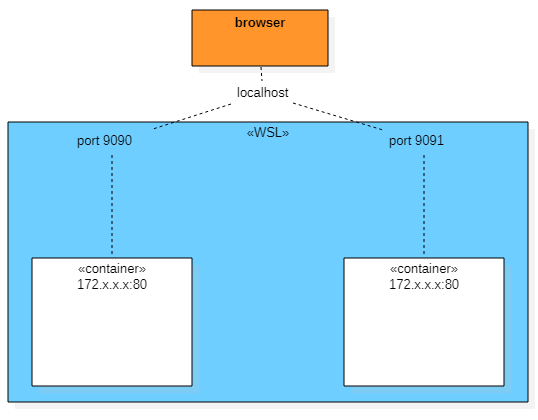

# Rapport laboratoire HTTP infrastructure RES 2021
## Auteurs
- Forestier Quentin
- Herzig Melvyn

---
## Étape 1) Mise en place d'un site statique avec apache httpd
Cette étape consiste à mettre un place une image Docker permettant de créer 
des conteneurs avec php:7.2.

### Apache-php-image
Ce répertoire (<i> Docker/apache-php-image</i>) contient le dockerfile permettant
la création du conteneur décrit plus haut.

Contenu du dockerfile:
```
FROM php:7.2-apache
COPY content/ /var/www/html/
```

Il indique la version de php sur laquelle construire l'image. Ensuite il copie le répertoire <i>content/</i> (local)
dans le répertoire <i>/var/www/html/</i> (du container). Ce dernier est utilisé pour la recherche des pages du site. Il est configurable dans
<i>/etc/apache2/sites-available/000-default.conf</i>.

### Template
Le template a été téléchargé sur: <a>https://startbootstrap.com/theme/agency</a>


### État de l'infrastructure
Un navigateur est capable de consulter les sites des deux conteneurs fabriqués à partir de Apache-php-image.

